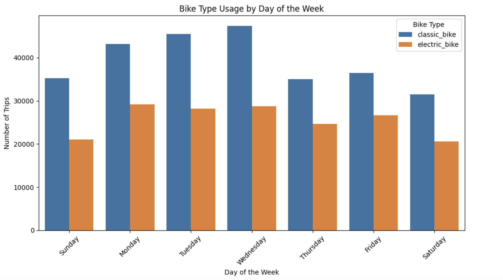
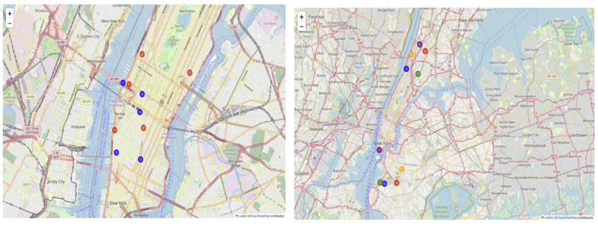

# Citi Bike NYC Spatial Data Analysis using Hadoop, SQL, SparkSQL and GeoPandas

This project performs a comprehensive analysis of New York City’s Citi Bike data for 2023, leveraging **Apache Hadoop** and **SparkSQL** for big data processing, **Pandas** and **GeoPandas** for data manipulation, and **Folium** for geospatial visualization. This project demonstrates proficiency in handling large datasets, performing complex SQL queries, and creating insightful spatial and statistical visualizations.

Note: 
To View the maps please use this link to view the notebook: 
https://nbviewer.org/github/asing349/Citi-Bike-NYC-Spatial-Data-Analysis-using-Hadoop-SQL-SparkSQL-and-GeoPandas/blob/main/Citi%20Bike%20NYC%20Data%20Analysis.ipynb

---

## Tech Stack

- **Apache Hadoop (HDFS)**: Scalable and reliable storage for the Citi Bike dataset, allowing efficient access to large data volumes.
- **Apache Spark**: Provides a distributed computing environment for executing SQL queries on large datasets.
- **SparkSQL**: Enables complex SQL querying, allowing deep analysis of the dataset.
- **Python and Pandas**: Used for data manipulation after converting from Spark DataFrames, providing easier integration with Python visualization libraries.
- **GeoPandas**: Extends Pandas to work with geospatial data, enabling spatial analysis and creating geometric boundaries.
- **Folium**: For mapping and visualizing geospatial data, including heatmaps and point-based visualizations for high-demand stations.
- **Matplotlib & Seaborn**: Used for general data visualization, including bar plots, column plots, and line charts.

---

## Project Structure

### 1. Data Storage and Processing
   - **Apache Hadoop (HDFS)**: The dataset (`citibike_2023.csv`) is stored in HDFS, providing scalable storage and high-speed access, suitable for large volumes of data.
   - **SparkSQL Session on HDFS Data**: A Spark session is established on the Hadoop system, allowing distributed processing of data directly from HDFS.

### 2. Data Loading and Initial Exploration
   - **Data Loading**: The dataset is loaded into a Spark DataFrame, which serves as the main structure for data exploration and processing.
   - **Data Integrity Checks**:
     - **Null Values**: Missing values are identified and handled to ensure data completeness.
     - **Column Integrity**: Each column is examined for data type accuracy and consistency.
   - **Temporary View for SQL Analysis**: The data is converted into a temporary view in Spark, enabling SQL-based data manipulation.

---

## SQL-Based Data Analysis

The project leverages SparkSQL for both basic and complex SQL queries, showcasing SQL skills and distributed querying capabilities.

### 1. Basic SQL Queries
   - **Total Trips**: Calculates the total number of trips, providing a high-level understanding of the dataset.
   - **Trips by User Type and Day of the Week**: Counts trips by user type (member vs. casual) and day of the week, identifying usage trends.

### 2. Advanced SQL Queries
   - **Top 5 Most Frequent Routes**: Identifies the most popular travel routes between start and end stations.
   - **Average Trip Duration by Bike Type, Hour, and Day of the Week**: Analyzes how trip durations vary by bike type, time of day, and day of the week.

---

## Data Visualization

SQL query results are visualized through a range of charts, providing a graphical understanding of bike usage patterns, demand trends, and user behaviors.

### 1. Bar Plot for Total Trips by Bike User Type
   - Displays the total number of trips by bike user type, offering a quick introductory insight into the dataset.

### 2. Column Plot for Popular Stations
   - Highlights the most popular start and end stations, helping to identify high-demand areas.

### 3. Line Plot for Usage by Hour of Day
   - Shows the distribution of trips across different hours, pinpointing peak bike usage times.

### 4. Bike Type Usage by Day of the Week
   - Visualizes usage of each bike type (e.g., classic, electric) across the days of the week.

     

### 5. User Type Usage by Day of the Week
   - Compares bike usage patterns for members and casual users across different days.

---

## Geospatial Analysis and Visualization

In addition to SQL-based insights, this project includes a comprehensive spatial analysis of the Citi Bike data to understand geographical patterns, high-demand zones, and popular routes across NYC. By leveraging **GeoPandas** and **Folium**, we visualize key locations and routes to reveal valuable insights.

### 1. Conversion to Pandas for Geospatial Analysis
   - The Spark DataFrame is converted to a Pandas DataFrame, allowing integration with geospatial libraries such as GeoPandas and Folium for spatial visualization and analysis.

### 2. Geospatial Analysis with GeoPandas
   - **Geopy Distance Calculations**: Calculates the geodesic distance between start and end stations, facilitating distance-based analysis of routes taken by users.
   - **Convex Hull Visualization**: Constructs convex hulls (smallest polygons covering a set of points) around the top 5 most frequent start and end stations, highlighting areas with concentrated bike activity.

### 3. Mapping with Folium
   - **Top 5 Start and End Stations**: Displays the five most frequently used start and end stations as distinct markers on the map, providing a visual overview of high-demand locations.
   - **Top 5 Longest Distance Station Pairs**: Highlights the top 5 station pairs with the longest trip distances (in kilometers), providing insights into the most extensive routes taken by Citi Bike users.
   - **Top 5 Busiest Start-End Pairs**: Visualizes the top 5 most frequently traveled routes, with unique colors for each start-end station pair to highlight the most popular routes.
   - **Convex Hull Boundaries for High-Demand Stations**: Draws convex hull boundaries around the top 5 start stations (in green) and top 5 end stations (in red), visually distinguishing high-demand areas.
   - **Heat Map of Trip Density**: Displays trip density across NYC, with brighter colors representing zones of higher trip activity, offering a clear picture of spatial demand distribution.

  

### 4. Spatial Data Analysis and Insights
   - **Top 5 Start-End Station Pairs**: Mapped with unique colors to identify frequently traveled routes and popular paths within the Citi Bike network.
   - **Cluster Analysis**: Highlights regional patterns in bike usage, revealing spatial dependencies and insights into rider behavior across different NYC neighborhoods.

---

## Project Insights and Conclusion

This Citi Bike analysis project provides a comprehensive look into NYC bike-sharing patterns, uncovering insights for decision-making and resource optimization. Key findings include:

- **Peak Hours and Days**: Identified high demand on weekends and during certain hours, especially among casual users.
- **Top Stations and Routes**: Frequently used stations and routes, which can guide resource allocation and maintenance.
- **Geospatial Hotspots**: High-demand areas identified through density mapping and convex hull analysis.

---

## How to Run the Project

1. **Set up the environment**:
   - Ensure Hadoop and Spark are installed and configured with HDFS for data storage.
   - Install necessary Python libraries: `pandas`, `geopandas`, `folium`, `matplotlib`, `seaborn`.

2. **Run the Jupyter Notebook**:
   - Open the notebook and execute each cell sequentially. SQL queries, data loading, and transformations are handled within the notebook.

---

## Repository Structure

- **notebook/**: Contains Jupyter notebooks with all data processing and visualization code.
- **data/**: Folder for raw and processed data.
- **imgs/**: Folder containing static images used in this README for visualizations.

---

This project demonstrates expertise in big data technologies, data anlysis and spatial analysis to extract meaningful insights from bike-sharing data, highlighting both technical skills and analytical abilities.
